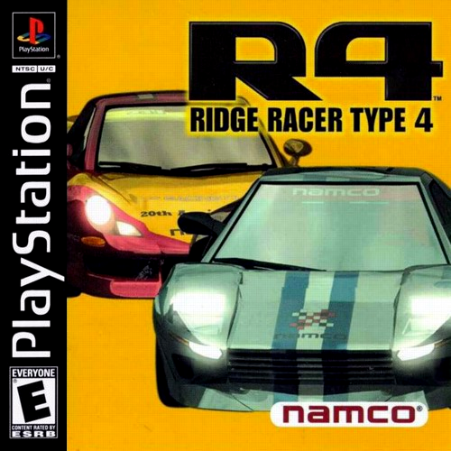

# RidgeRacerType4Recomp

<p align="center">
  
</p>

> _In-development preview, not a finished port — expect rough edges._

R4: Ridge Racer Type 4 (USA, SLUS-00797) statically recompiled to a native
executable with [psxrecomp](https://github.com/RetroPortingToolKit/psxrecomp)
and [recomp-ui](https://github.com/RetroPortingToolKit/recomp-ui), structured
after [MegaManX6Recomp](https://github.com/mstan/MegaManX6Recomp).

## What This Is

The game's MIPS code is machine-translated ahead of time into C, then compiled
into a native program that runs the game's own logic on psxrecomp's simulation
of the PS1 hardware (GPU, SPU, GTE, MDEC, CD-ROM, pads, memory cards) and the
real, recompiled PS1 BIOS — no high-level emulation shims.

This repository holds the game-specific configuration, seeds, tools and build
glue, plus `generated/`: the boot EXE's code machine-translated to C,
committed so that a release can ship the compiled game. The C keeps every
original MIPS instruction word next to its translation (see License). The
repository does **not** contain the disc image, the game's data, a BIOS dump,
or any code derived from a retail BIOS. Builds use the MIT-licensed OpenBIOS
from PCSX-Redux; bring your own legally obtained disc.

Important files:

- `game.toml`: identity, disc digests, recompiler/runtime/video/controller/netplay config.
- `seeds/`, `annotations/`, `symbols.toml`: recompiler inputs grown from RE work.
- `generated/`: the recompiled game C (committed; `tools/regen.sh` rewrites it).
- `tools/regen.sh`: regenerate the game C from the disc.
- `tools/package_release.sh`, `scripts/package_release.sh`: build the release zip.
- `tools/run_r4.sh`, `tools/dbg.py`, `tools/pad.py`, `tools/smoke.py`: run and drive a debug build.
- `src/mods/`, `mods/preloaded/`: game-owned mods (widescreen); see `docs/WIDESCREEN.md`.
- `DISC.md`: Redump-verified disc identity. `ISSUES.md`: issue log.
- `docs/framework_pin_history.md`: why each submodule pin moved.

## Status

**Bring-up preview.** Boots, plays races, runs 2-player VS Battle over
netplay and online Link Battle for 2-4 players. Not yet verified end to end (see `ISSUES.md`).

| Area | State |
|---|---|
| BIOS boot | Works — recompiled OpenBIOS, HLE boot-skip and full LLE intro |
| Intro / attract movies (MDEC + XA) | Play; Start skips after the Namco logo |
| Menus, Grand Prix setup, race | Work |
| Audio (SPU + XA music) | Works |
| Code overlays (R4.BIN) | Captured and compiled to native shards in the background |
| VS Battle (2P split screen) | Works over netplay (delay-sync and rollback, digests match) |
| Link Battle | Online for 2-4 players, each on their own screen (`docs/ONLINE_BATTLE.md`); no physical link cable |
| Renderer | Stock psxrecomp OpenGL at 4:3; software selectable |
| Internal resolution | Native to 8K presets (Settings → Display), OpenGL |
| Camera look-around | Right stick turns the view in single-player races (Mods > Camera Look-Around), on by default |
| PGXP (steady geometry, straight textures) | Mods > Visual > PGXP Precision, on by default |
| Widescreen | Mods > Display > R4 Custom Renderer (experimental, off by default): native-wide races, Fit to Window / 16:9 / 21:9 / 32:9 |
| JogCon input | R4 JogCon Input compatibility is enabled by default; wheels retain guest JogCon ID and analog steering from the start grid |

## What's new / on by default

These are on when you first start the game. Each one is a switch on the
launcher's **Mods** page (or a choice inside it), and your choice is saved.
Switching a feature off gives you the stock game for that part.

| Feature | On by default | To turn it off |
|---|---|---|
| **Modern controls** (R4 Controls): RT gas, LT brake, left stick steers, Square / Circle shift, R1 camera, Y Rewind | Yes, Modern scheme | Mods → Controllers → **Controls**: pick **Classic** for R4's stock controls (Cross accelerates, Square brakes), or switch the feature off |
| **Camera look-around**: the right stick turns the view in single-player races | Yes | Mods → **Camera Look-Around** off |
| **Hide rear-view mirror**: skips the mirror inset at the top of the race screen | Yes | Mods → **Hide Rear-view Mirror** off brings the mirror back |
| **JogCon input**: recognized steering wheels drive as R4's JogCon; ordinary gamepads use native DualShock analog steering | Yes | Mods → **JogCon Input** off; the pad mode is under Settings → Controller |
| **PGXP**: steady geometry and straight (perspective-correct) textures, with precise culling so the far road has no gaps | Yes | Mods → Visual → **PGXP Precision** off, or turn only its **Precise culling** option off |
| **Max Detail**: longer draw distance (far bridges, buildings and road no longer pop in), full course and car detail at every distance, 1P detail in split screen, car reflections in the race | Yes | Mods → Detail → **R4 Max Detail** off, or set any one option (Draw distance, Course detail, Car detail, Split screen, Car reflections) back to **Stock**. Mirror scenery stays Stock unless you choose Full |
| **VS split screen**: the OpenGL renderer draws 2P split screen in about a tenth of the draws (same picture) | Yes | Set `PSX_GL_TEXWIN_BATCH=0` for one run |
| **VS split screen interpolation**: with R4 Frame Rate on, 2P split-screen races are drawn at the higher rate too | Comes with Frame Rate, which is off by default | Mods → Frame Rate → **R4 Frame Rate** off |
| **Online battle, 2-4 players**: R4's Link Battle over the internet or LAN, each player on their own machine with their own full-screen view | Available from the launcher's NETPLAY page | Just play offline; local split screen stays 2-player VS Battle |
| **No Rewind in split screen or online**: Rewind is off in 2-player VS Battle and in every netplay session, so a rewind can't put one player out of step | Yes, always | Not a setting. Rewind still works in single-player races (enable it in Settings; Y in Modern, Select + Y in Classic) |

In netplay every peer runs without the game-changing mods. The ones that only
change your own screen or your own pad (hide mirror, widescreen in your own
Link Battle view, Modern controls) follow each player's own choice.

Coming once the framework changes they need are merged: display defaults
(dynamic resolution and window settings tuned for R4), **Smooth motion**
(frame-rate interpolation on by default), the **HD HUD** pack, and
**anti-aliasing**.

## Playing a release

A release zip is the compiled game. Nothing is generated or built on your
computer, and the zip holds no disc data and no BIOS dump: you bring the disc.

You need:

- Your own **R4: Ridge Racer Type 4 (USA)** disc image as the Redump
  **bin/cue** (SLUS-00797, one track; hashes in `DISC.md`). Do not convert it
  to `.iso`: that drops the streamed music and movies.
- macOS 11 or later (`macos-arm64` for Apple Silicon, `macos-x64` for Intel),
  or Windows 10/11 x64.
- Optional on macOS: Apple's Command Line Tools (`xcode-select --install`).
  With them, the menus R4 loads as code overlays (garage, car select, course
  info, records) are compiled to native code in the background on your first
  visit; without them those menus run in the interpreter, which is slower
  but works. Windows needs nothing: the zip carries its own compiler.

1. Extract the zip to a folder you can write to, e.g. `~/Games/R4` or
   `C:\Games\R4`. Saves (`saves/`) and settings are kept beside the game.
2. macOS: this build is not notarized, so macOS blocks it the first time. Run
   `xattr -dr com.apple.quarantine ~/Games/R4` once (your folder's path), or
   click **Open Anyway** in System Settings → Privacy & Security after a
   blocked launch. Windows: if SmartScreen warns, choose **More info → Run
   anyway**.
3. Run `r4-runtime` (`r4-runtime.exe`). On first run, **Browse Disc** and pick
   your `.cue`; it is checked against the Redump hashes and never copied. Then
   **Continue to launcher** and **Play**.

The game runs on the bundled OpenBIOS. To use your own SCPH-1001 dump
instead, pick it under Settings → System → BIOS: the game compiles a backend
for it from your dump once (about a minute; on macOS this needs the Command
Line Tools) and uses it from then on. Widescreen and frame rate are under
**Mods** and internal resolution under **Settings → Display**, all off by
default; the features on by default are listed under "What's new" above.

To update, extract the new zip over the old folder. Memory cards and settings
carry over. Savestates from an older version are refused, and code overlays
are compiled again on first visit.

## Building From Source (macOS, Windows)

Requirements: Xcode command-line tools, `brew install cmake ninja python`,
and R4: Ridge Racer Type 4 (USA, SLUS-00797) as the Redump bin/cue (verify
against `DISC.md`). Do not convert it to a 2048-byte `.iso`: that drops the
Mode-2 Form-2 XA sectors the music and movies stream from. Linux and Windows
follow `psxrecomp/docs/BUILDING.md`.

```sh
git clone --recurse-submodules <this repo> && cd ridgeracertype4
mkdir -p disc   # put (or symlink) the .cue and .bin here
# emitters for the dev overlay compiles tools/run_r4.sh sets up
bash psxrecomp/tools/ci/build_emitters.sh --framework psxrecomp --build-dir build-recompiler
cmake -S . -B build -G Ninja -DCMAKE_BUILD_TYPE=Release -DPSX_DEBUG_TOOLS=ON
cmake --build build --target psx-runtime
tools/run_r4.sh build       # straight into the game; or build/r4-runtime for the launcher
```

The game C in `generated/` is committed, so a build needs no generate step.
After changing seeds, annotations, `[recompiler]` config or the `psxrecomp`
pin, regenerate it and commit the result:

```sh
tools/regen.sh --disc "disc/R4 - Ridge Racer Type 4 (USA).cue"
```

`tools/regen.sh` builds the emitters into `build-recompiler/`, verifies the
disc against `game.toml [prepare_disc]`, extracts the boot EXE to `disc/`, and
rewrites `generated/`. The recompiled BIOS backends come with the `psxrecomp`
submodule. Drop `-DPSX_DEBUG_TOOLS=ON` for a build without the TCP debug
server. The first configure downloads the pinned static SDL3 on macOS (libjuice
for netplay is vendored). Add `-DR4_BUILD_TESTS=ON` to register the developer
tests (`tests/`, `tools/`), then run `ctest --test-dir build`. The
widescreen cull-site check among them reads the disc's `.bin` in `disc/`; the
configure warns when it is missing.

Code overlays (R4.BIN menus) compile to native shards in the background only
when `PSX_OVERLAY_AUTOCOMPILE_CMD` is set; `tools/run_r4.sh` / `run_r4.cmd`
set it for dev runs, using the emitters in `build-recompiler/` (the quick
start builds them, and so does `tools/regen.sh`; `tools/run_r4.sh` says when
they are missing). Launching `build/r4-runtime` directly works, but those
menus stay in the interpreter.
Release zips ship an `overlay_toolchain/` instead, which is why `game.toml`
does not carry a dev compile command.

**Windows** builds the same way from an MSYS2 **MINGW64** shell
(`pacman -S mingw-w64-x86_64-{gcc,cmake,ninja,python} git`): run the same
`cmake` commands, then start `build\r4-runtime.exe`, or `tools\run_r4.cmd`,
which also puts MinGW64 on PATH so background overlay compiles can find
`python3` and `gcc`. The exe imports only Windows system DLLs.

### Packaging a release

`tools/package_release.sh [git-ref]` builds the release zip(s) from a
throwaway clone of a commit: `dist/r4-<version>-macos-arm64.zip` and
`-macos-x64.zip` on a Mac (one universal, ad-hoc signed build), or
`-windows-x64.zip` from an MSYS2 MINGW64 shell. It links the committed
`generated/` C and only the OpenBIOS backend, packages with psxrecomp's
`tools/package_game_release.sh` (through `scripts/package_release.sh`), and
checks every zip: the game, both R4 mods, `overlay_toolchain/` (the two
emitters, runtime headers and a Python runtime the game compiles overlays
with) and the third-party notices are in it; R4 and framework sources,
generated C, emitters at the root, disc data and BIOS images other than
OpenBIOS are not. Releases are built locally; there is no CI workflow.

## Configuration

Most options are in the launcher and persist to `settings.toml` beside the
executable. Defaults live in `game.toml`:

- `[video]` — `renderer` (`opengl` / `software`), `aspect_ratio = "4:3"`,
  `resolution_reference_lines = 240` (see Internal resolution).
- `[controller]` — `default_mode` (`analog` by default for native R4
  DualShock steering; recognized SDL steering wheels use emulated JogCon);
  `direct_shortcut = "rewind"` with `direct_shortcut_button = "y"` (Rewind's
  default pad button; alone in Modern controls, Select + Y otherwise).
- `[runtime]` — `disc_speed = "1x"` (authentic; R4 streams XA with a data
  channel), `overlay_cache` (native overlay shards; see Building From Source).
- `[netplay]` — disc gates: `require_cue`, `required_tracks = 1`, `required_disc_fp`.

## Frame rate (optional mod)

Mods -> Frame Rate -> **R4 Frame Rate** (experimental, off by default) shows
races at the display's refresh rate or at 60 / 100 / 120 / 200 / 240 / 300 FPS.
The game itself still runs at its original 30 Hz: lap times, AI, input and
music are unchanged.

- **Interpolated** (default): the race is redrawn between game frames with
  the cars and camera part of the way to the next frame, by the game's own
  draw code inside a psxrecomp render pass (frozen guest time, everything
  restored afterwards). No added latency. Grand Prix, Time Attack and VS
  split-screen races, the attract demo and the replay after a Time Attack
  are interpolated; menus, pause, results and movies are shown as on a PS1.
  Where the renderer cannot draw in-between frames at all, or
  more than a quarter of the last second's frames get none in time (e.g. at
  a high internal resolution), the package falls back to Frame blend and
  says so in the log; it returns once at most a tenth of them would miss out.
- **Frame blend**: crossfades finished frames (cheaper, ghosts, one frame
  late).

It needs the OpenGL renderer and turns vsync off. A monitor shows at most its
own refresh rate, so rates above it cost more without showing more motion
(with vsync off they can show as tearing instead).
If the machine cannot draw every in-between frame, fewer are drawn and the
gaps between them crossfaded; in-between frames are planned into the time
the presenter would otherwise wait. Netplay sessions run without mods, except
widescreen in your own Link Battle view (per player).
Details and credits:
`mods/preloaded/packages/r4.enhancement.frame-rate/1.0.0/README.txt`,
`src/mods/r4_interp.c`, `psxrecomp/docs/RENDER_PASSES.md`.

## Internal resolution

**Settings → Display → Internal resolution** renders the game at a higher
resolution instead of stretching 320×240 (OpenGL). It is off (Native) by
default and takes effect when the game starts.

| Preset | Scale | Race frame | Notes |
|---|---|---|---|
| Native | 1× | 320×240 | Unchanged |
| 720p | 3× | 960×720 | |
| 1080p | 5× | 1600×1200 | Resolved down to the window |
| 1440p | 6× | 1920×1440 | |
| 4K | 9× | 2880×2160 | |
| 5K | 12× | 3840×2880 | |
| 8K | 18× | 5760×4320 | Past a 16384 GPU texture limit (Apple GPUs) only the displayed frame is kept at 8K |
| Match display | monitor height ÷ 240 | | Your monitor's pixel height |

- The menus are 480-line screens, so they render at twice the target and are
  resolved down; movies are unchanged.
- Textures stay the game's own; edges, geometry and the rear-view mirror get
  sharper. PGXP (below, on by default) keeps polygons from wobbling; with it
  off, the wobble is the PS1's integer vertex snap, magnified.
- On a Mac, any preset above Native gives the game window a Retina (full
  pixel density) drawable.
- The GPU can lower a preset it cannot hold; the log line and the `video_info`
  debug command show the scale actually used. On an Apple M4 the 4:3 race
  measured 58.8 guest frames/s at 8K (60 is full speed) in a debug-tools
  build with its per-frame readback off; with widescreen, 8K is slower (32:9
  about 45). A release build was not measured.
- At 8K on a GPU with a 16384 texture limit (Apple GPUs), widescreen's Fit
  to Window goes up to about 34:9; a wider window is pillarboxed.
- Netplay: your own view only. Other players are unaffected and may use a
  different setting. Frame-rate options, when present, are mods and are turned
  off for netplay; widescreen stays on for your own Link Battle view only;
  internal resolution is not affected.
- `PSX_INTERNAL_RESOLUTION=4k` (or any preset id, or a number of lines)
  overrides the setting for one run. `tools/res_matrix.py` checks every preset
  against a savestate.

## PGXP: steady geometry and straight textures

Mods -> Visual -> **PGXP Precision** is on by default, and it is the only
PGXP switch: Settings has no Perspective textures row for R4
(`[video] pgxp_mod_only`). The PS1 snaps every projected vertex to a whole
pixel and maps textures without perspective, so polygons wobble as the camera
moves and road, wall and sign textures bend at polygon edges. PGXP follows
each vertex's full-precision projection from the GTE to the GPU and draws it
there, with perspective-correct textures.

- **Precise culling**, an option of the same package, is on too. The game
  drops a polygon it sees as zero-sized or facing away, and on the PS1 that
  test uses the rounded positions. With PGXP drawing the exact ones, the far
  road beyond the start gantry and over crests broke into thin strips with
  sky between them. Precise culling makes the game decide from the positions
  PGXP draws, so those rows are drawn. This one changes what the game computes:
  with it the game emits up to about a quarter more polygons. Its packet
  buffers peaked at 60% in a 2P race, and its timing (one frame every two
  VBlanks) is unchanged.
- Without precise culling PGXP is visual only: with PGXP off, or on with
  culling off, the game runs exactly as on the stock build (checked over
  12000 frames of boot, menus and the attract race). Switching PGXP off
  restores the original picture.
- Textures are corrected at every internal resolution; the steadier geometry
  shows above Native (the picture is still drawn on whole pixels at Native).
- Every vertex is checked against the exact packet word the game drew with,
  and one that cannot be proven draws the original way (the tachometer needle,
  2D screens, vertices clamped far off-screen). In a Grand Prix race 99.9% of
  polygon vertices are corrected and every textured triangle gets
  perspective-correct UVs.
- Far, thin features now draw at their true size: distant lane dashes and the
  start line show in the mirror, grid lines across the road at the start, and
  the START!! board at the far end of the straight looks smaller than on a
  PS1. The first frame after loading a savestate draws without PGXP.
- Cost: on a 2P race with the other enhancements at their defaults, about
  1.5 ms more per frame, mostly the extra polygons.
- Netplay sessions run without it, like every mod.
- The runtime is built with psxrecomp's PGXP hooks (`R4_PGXP`, on by default;
  `-DR4_PGXP=OFF` builds without them, for A/B checks). Savestates from a
  build with the other setting are refused. `game.toml` `[video]` sets the
  PGXP tuning R4 needs (`pgxp_tolerance = -1.0`,
  `pgxp_position_fallback = false`, `pgxp_preserve_projection = true`; see
  `psxrecomp/docs/ENHANCEMENTS.md` G1.11/G1.12).

## Max Detail (on by default)

Mods -> Detail -> **R4 Max Detail** removes the detail R4 drops with distance
to fit the PlayStation:

- **Draw distance** (Maximum / Extended / Stock): far bridges, buildings and
  road no longer pop in late; Maximum also loads the scenery of the track
  sections ahead and behind (in views narrower than about 30:9).
- **Course detail** (Always full / Stock): full-resolution textures and smooth
  shading at every distance and in the rear-view mirror, instead of the
  blurred, flat-shaded far course.
- **Car detail** (Always full / Stock): full car models (3D wheels, full
  texture) out to the normal car draw distance.
- **Split screen** (Same as 1P / Stock): VS races get 1P detail. Split screen
  already renders at the chosen internal resolution.
- **Car reflections** (On / Stock): reflective car bodies during the race, as
  in the fly-by and replays (stock R4 turns them off from the start signal to
  the finish). For now in 4:3 views only: the widescreen renderer draws them
  many times slower, so widened views keep Stock.
- **Mirror scenery** (Stock / Full, **off by default**): Full draws all the
  scenery behind you in the rear-view mirror instead of the nearest few track
  blocks. It costs the emulated PlayStation the most time of anything here.

Game logic is unchanged. The extra drawing costs the emulated PlayStation
time; in the races measured (Helter Skelter and the two attract-demo courses,
4:3 to 32:9, 1P and 2P) the game kept its 30 FPS race rate. Other courses are
untested. Any option can be set back to Stock; with the package off the game
runs exactly as before. Netplay sessions run without mods. Details:
`docs/MAX_DETAIL.md`.

## Controls

Keyboard and SDL gamepads per recomp-ui's input settings. Gamepads use R4's
native DualShock analog mode by default. SDL-mapped steering wheels with
recognized names use JogCon steering on the mapped left-X axis; per-player
deadzone calibration applies. The default R4 JogCon Input compatibility package
routes R4's mode-2 JogCon state through its existing analog race-input path,
while preserving the emulated JogCon ID and wheel fields. Wheel force feedback
is not mapped. In R4's
menus **Circle is OK** and **Cross is cancel**; in races Cross accelerates by default.

Mods -> Controllers -> **Controls** (on by default) picks the race scheme:

- **Modern** (default): on a gamepad with analog triggers, RT is gas and LT
  is brake (analog), the left stick steers, Square / Circle shift down / up,
  R1 changes the camera view and Y opens Rewind (enable Rewind in Settings).
  The stick steers in either pad mode. R4 sees its native NeGcon while you
  drive; menus, the pause menu, keyboards and pads without triggers keep the
  stock controls.
- **Classic**, or the feature off: R4's stock controls, unchanged (Cross
  accelerates, Square brakes); Rewind is Select + Y.

Rewind is off in split screen and online (2-player VS Battle, netplay), with
any scheme.

Netplay always runs with mods cleared. Details:
`mods/preloaded/packages/r4.modern-controls/1.0.0/README.txt`; headless check:
`tools/test_modern_controls_runtime.py`.

## Netplay

Two players, one per controller port: VS Battle's split screen. Use the
launcher's NETPLAY page (lobby, LAN, or Direct IP; rollback by default). Both
players need the same build and the same Redump dump — the `[netplay]` gates
refuse a mismatched disc. For a local two-instance test from the command line:

```sh
PSX_NET_MODE=rollback build/r4-runtime --no-launcher --netplay --net-slot 0 \
  --net-bind 127.0.0.1:7777 --net-session-id 1 --memcard-dir /tmp/p1 --debug-port 4797
PSX_NET_MODE=rollback build/r4-runtime --no-launcher --netplay --net-slot 1 \
  --net-bind 127.0.0.1:7778 --net-peer 127.0.0.1:7777 --net-session-id 1 \
  --memcard-dir /tmp/p2 --debug-port 4798
```

Details: `psxrecomp/docs/NETPLAY.md`.

Online Link Battle for 2-4 players: the host opens a room on the launcher's
NETPLAY page and the others join; in the game choose Link Battle. The
host is Player 1, each joining player takes the next seat, and everyone sees
their own car full screen. Local split screen stays two players (VS Battle).
See `docs/ONLINE_BATTLE.md` for the design and limits.

## Memory Cards

Standard PS1 `.mcd` images in `saves/`, compatible with common emulators. Local
only; never commit them.

## Overlay cache

R4 streams code overlays from `R4.BIN`. The runtime records visited overlays in
`overlay_captures.json` and compiles native shards into `cache/` beside the
executable. **Do not publish `overlay_captures.json`** — it contains verbatim
snapshots of the game's code.

## Development Rules

- Real recompiled BIOS and hardware simulation; no HLE shims, no stubs, no
  hand-edited `generated/`.
- Framework fixes go to `psxrecomp`, not here. Resolve dispatch misses first
  (`tools/smoke.py` reports segment misses beside them).
- Disc images, BIOS dumps, memory cards, Ghidra databases and build outputs
  stay local. `generated/` is committed: regenerate it, never hand-edit it.
  See `CLAUDE.md`.

## License

MIT for this repository's own code — see `LICENSE`. Files adapted from
MegaManX6Recomp (listed in `THIRD-PARTY-LICENSES/README.md`) stay under
PolyForm Noncommercial 1.0.0, and the
`psxrecomp` and `recomp-ui` submodules carry their own licenses; release zips
carry their notices in `licenses/` and `assets/`. R4: Ridge Racer Type 4 is
© Namco (Bandai Namco Entertainment). Neither this repository nor its release
zips contain the disc image or the game's data (models, textures, audio,
movies, the `R4.BIN` overlays). Two things in them do come from the game:

- `generated/` is the boot EXE's code translated to C by psxrecomp, and the
  compiled game is built from it. psxrecomp keeps each original MIPS
  instruction word beside its translation (in a comment and as an argument
  to the PGXP hooks), so the EXE's code section can be read back out of
  `generated/`; its data section is not there.
- The launcher's box art (`recomp/launcher/boxart.*`, shipped as
  `assets/img/boxart.tga`) is the game's cover; see
  `THIRD-PARTY-LICENSES/README.md`.

The compiled game needs your own disc to run.
